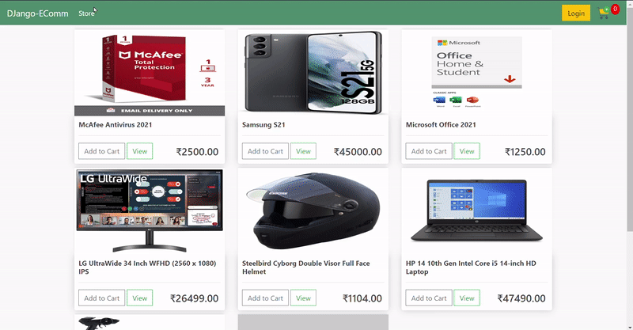

# Django e-Commerce Website

Web application built with the goal of learning - how to built Django Models and Views more efficiently

## Technologies used:

-   DJango
-   Bootstrap
-   JavaScript

## Features:

-   Adding items to cart from home page
-   Editing quantity(Add or Remove) of items on cart page
-   Uploading items
-   **Guest User Operations, including _checkout_**
-   Payment integration (_not implemented yet_)

> This project is part of Django tutorial series by [Dennis Ivy](https://www.youtube.com/channel/UCTZRcDjjkVajGL6wd76UnGg "Dennis Ivy's Youtube Channel")
